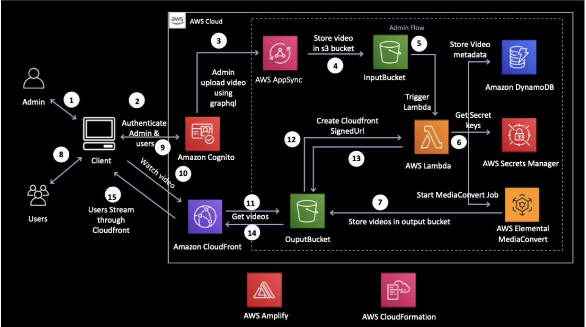

## Getting Started

First, run the development server:

```bash
npm run dev
# or
yarn dev
# or
pnpm dev
```

Open [http://localhost:3000](http://localhost:3000) with your browser to see the result.

## Goal of this project

The goal was to implement the following logic

- A visitor can see multiple free and premium E-Books
- A visitor can read an E-Book and track the reading progress
- A visitor sees a payment wall for a premium E-Books
- An analytics event should be tracked when the visitor clicks on the purchase button.

- Additionally, describe how a potential integration of video content and a selfservice area for our business customers can look like (uploading and managing their own content). How would your architecture look overall?

In addition:
- how I approach such a task in general
- on what criteria I base my decisions
- how I construct a solution

DEADLINE: Thursday at midnight

## My approach for this project

- Get an overview via Figma about the project in general
- Build a first version of all logics as fast as possible
- After that start to improve the code step by step, that means make it cleaner, more maintainable and so on.

## My biggest issue

- I lost too much time to implement the analytics part, that means Google Analytics and Google Tag Manager. I have not solved that problem yet. Very annoying. Instead of I skipped the rest of this part in order to complete this project as good/fast as possible in the rest of the time.

- Second issue was the implementation of the reading progress. It was not possible with a framework to get the current page and total pages of a ebook. When it could be possible to view the text as a normal blog article, then it is easy to implement the reading progress because one can just use the current scrolling position of the text.


## Result of this project

- A visitor can see multiple free and premium E-Books (see the path "/ebooks")


- A visitor can read an E-Book and but do not track the reading progress. Alternativ solution could be to make a download available for the user. 


- A visitor sees a payment wall for a premium E-Books.


- An analytics event should be tracked when the visitor clicks on the purchase button.

```
Unfortunately I could not solve the problem yet.


- Additionally, describe how a potential integration of video content and a selfservice area for our business customers can look like (uploading and managing their own content). How would your architecture look overall?

```
I thought I could implement that in an easy and fast way but it took for me much more time than I thought. I started with Uploading files like images or videos. But could not continue.

Instead of I just thought about the architecture and found a recommendation by AWS:


### Walkthrough of the workflow
1. Admin logs into the application, authenticated by Cognito, and uploads the video.
2. AppSync uses GraphQL API to upload the video to the S3 Input bucket.
3. A Lambda function is triggered as soon as the video is dropped in the Input bucket. This function initiates the MediaConvert job to convert videos in different formats.
4. An additional Lambda function is triggered to store the metadata of converted video in DynamoDB.
5. Converted videos are then stored in Output bucket.
6. CloudFront streams the videos to registered end-users.
7. CloudFront signed URLs are generated when authenticated user request the video. The final stream plays as an Apple HLS adaptive bitrate stream.

### Benefits of the this solution
- Scalability of video delivery solution using the CloudFront CDN
- Security of video content to prevent unauthorized access and ensure it can’t be played outside the customer’s application using S3 and CloudFront signed URLs
- Automated transcoding of video content using MediaConvert
- Support for multiple devices using adaptive bitrate streaming for playback in all network conditions without buffering delays
- Securely storing and retrieving secret keys from Secrets Manager
- Quickly building and deploying the solution using Amplify and CloudFormation

### Additional setup information
- Signed Cookies/URLs: Allow CloudFront to configure Expiry Time, Allowed IP Address, FileName for each URL. By default, No Read access is assigned to content distributed by the CDN. Content can only be downloaded and accessed when requested using the proper Signed Cookies generated by the app.
- S3 CORS configuration: Configure which website(s) can be allowed to access the content via S3/CDN. Learn more about S3 CORS configuration in this blog post.
- Amplify and CloudFormation facilitate quick deployment of resources and services involved on the backend of the solution.

### Step-by-step guide
This serverless, VOD workflow solution is built using several AWS services including Amazon Cognito, AWS AppSync, Amazon S3, AWS Lambda, Amazon DynamoDB, AWS Secrets Manager, AWS Elemental MediaConvert, Amazon CloudFront, AWS Amplify, and AWS CloudFormation.

In this solution, Cognito authenticates users for the web application through Cognito User Pools, which protect access to the GraphQL API. The API has fine-grained access based on the group in the Cognito User Pool. Cognito also generates temporary, limited-privilege AWS credentials for access to upload content into S3.

AppSync, which uses GraphQL API, enables client apps to fetch, change, and subscribe to data from servers. In our solution, we are performing CRUD (Create/Read/Update/Delete) operations on video using GraphQL API and storing the video in a S3 bucket.

Two S3 buckets are used in this workflow: one for storing raw videos and another for storing videos with different output formats and bitrate.

Multiple Lambda functions serve different purposes: triggering MediaConvert jobs, storing metadata in DynamoDB, creating signed URL tokens, and sending notifications as MediaConvert jobs finish.

MediaConvert automatically transcodes the uploaded video in HLS format for 2 Mbps, 1 Mpbs, 600 Kbps, and 400 Kbps. Video content is encoded as adaptive bitrate streams for playout on multiple devices with varying network bandwidth connections.

Secrets Manager securely stores CloudFront private keys, which are then used for signing the CloudFront URL. CloudFront securely delivers the content via CDN Edge locations to authorized users via the application at runtime.


## Conclusion of the project
It was a really nice and interesting tech challenge to see where are still some deficits and what I already forgot again. The next time I will plan much more time.
